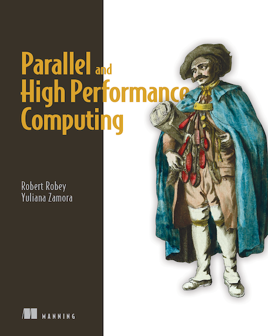

  
<h1 align="center">
  
Parallel and High Performance Computing

  
</h1>
  
<b>Robert Robey · Yuliana Zamora 저</b> 
Manning · 2021년 6월 22일 출시 
[[source code](https://www.manning.com/downloads/2309)]</b> 

## :bulb: 목표

- **병렬 프로그래밍 및 고성능 컴퓨팅 이해하기**

  > 효율적인 병렬 프로그래밍과 고성능 컴퓨팅 기본 개념 이해하기

 

## :mag: 목차

### PART 1 INTRODUCTION TO PARALLEL COMPUTING

    1 WHY PARALLEL COMPUTING?

    2 PLANNING FOR PARALLELIZATION

    3 PERFORMANCE LIMITS AND PROFILING

    4 DATA DESIGN AND PERFORMANCE MODELS

    5 PARALLEL ALGORITHMS AND PATTERNS

### PART 2 CPU: THE PARALLEL WORKHORSE

    6 VECTORIZATION: FLOPS FOR FREE

    7 OPENMP THAT PERFORMS

    8 MPI: THE PARALLEL BACKBONE

### PART 3 GPUS: BUILT TO ACCELERATE

    9 GPU ARCHITECTURES AND CONCEPTS

    10 GPU PROGRAMMING MODEL

    11 DIRECTIVE-BASED GPU PROGRAMMING

    12 GPU LANGUAGES: GETTING DOWN TO BASICS

    13 GPU PROFILING AND TOOLS

### PART 4 HIGH PERFORMANCE COMPUTING ECOSYSTEMS

    14 AFFINITY: TRUCE WITH THE KERNEL

    15 BATCH SCHEDULERS:BRINGING ORDER TO CHAOS

    16 FILE OPERATIONS FOR A PARALLEL WORLD

    17 TOOLS AND RESOURCES FOR BETTER CODE

